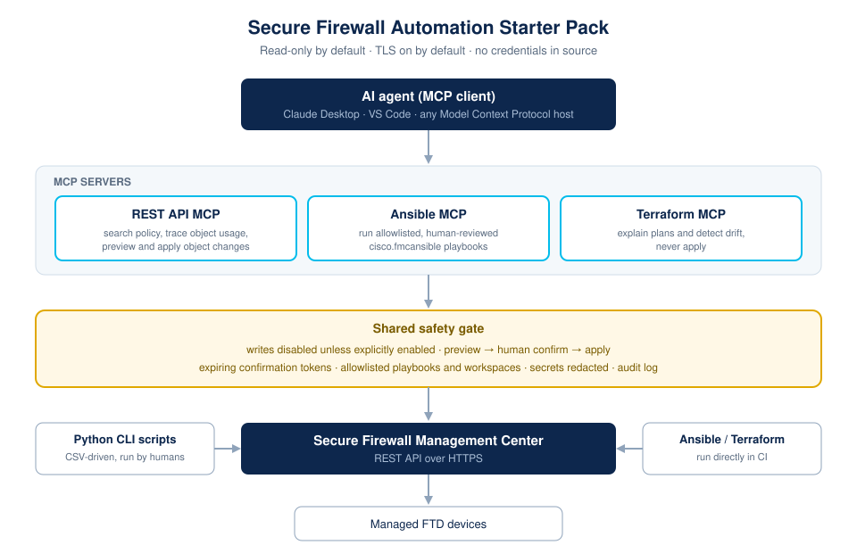
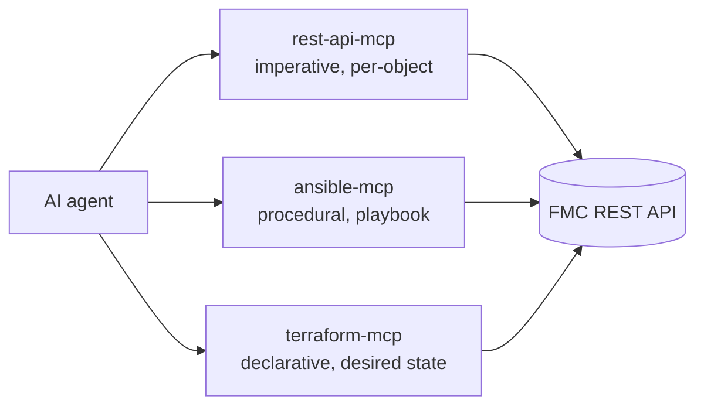

# MCP Servers for Cisco Secure Firewall Automation

Three [Model Context Protocol](https://modelcontextprotocol.io) servers that let an AI
agent drive Cisco Secure Firewall automation — one per automation style used elsewhere
in this repository.



| Folder | Server | What the agent gets | Deploy |
| --- | --- | --- | --- |
| [rest-api-mcp/](rest-api-mcp/) | Secure Firewall REST API MCP Server | Direct FMC REST tooling: inventory, object search, object-usage tracing, rule listing, and a **preview → confirm → apply** change pipeline | stdio + HTTP/Stream |
| [ansible-mcp/](ansible-mcp/) | Ansible MCP Server for Secure Firewall | Allowlisted `cisco.fmcansible` playbooks with syntax check, `--check` dry run, and gated execution | stdio + HTTP/Stream |
| [terraform-mcp/](terraform-mcp/) | Terraform MCP Server for Secure Firewall | `init` / `validate` / `plan` / `show` with structured plan summarisation and drift detection; `apply` off by default | stdio + HTTP/Stream |

Each folder is **self-contained and independently submittable** to
[Cisco DevNet Code Exchange](https://developer.cisco.com/codeexchange/): it has its own
README, article, licence reference, dependencies, container build, tests, and metadata.

## Why three servers instead of one

The already-published
[CiscoFMC-MCP-server-community](https://developer.cisco.com/codeexchange/github/repo/CiscoDevNet/CiscoFMC-MCP-server-community/)
answers *"where is this IP allowed?"* — it is a read-and-search server over access
policy. These three answer the next three questions an engineer asks, and they map onto
the three ways teams actually operate a firewall estate:



- **REST API** — *"make this one change now."* Ad-hoc, ticket-driven work.
- **Ansible** — *"run the approved procedure."* Repeatable runbooks, change windows.
- **Terraform** — *"is reality still what we declared?"* Desired state and drift.

An agent can use all three together: search with REST, remediate with Ansible, then
prove there is no drift with Terraform.

## The safety model (shared by all three)

Pointing a language model at a firewall management plane is only acceptable with hard
guardrails in the server, not in the prompt. All three implement the same contract:

1. **Read-only by default.** Every write path is disabled until an explicit environment
   flag is set (`FMC_ALLOW_WRITES`, `ANSIBLE_MCP_ALLOW_RUN`, `TF_MCP_ALLOW_APPLY`).
2. **Preview before change.** Mutating tools are split into a `preview_*` tool that
   returns a plan plus a short-lived, content-bound **confirmation token**, and an
   `apply_*` tool that refuses to run without it. A model cannot mutate anything in a
   single call, and cannot apply a plan different from the one a human saw.
3. **Allowlists, never free text.** The Ansible and Terraform servers execute a fixed
   argv against a resolved, allowlisted path. No shell, no string interpolation, no
   user-supplied binary or flags.
4. **TLS on by default.** `VERIFY_SSL=true`; a private CA is trusted with
   `FMC_CA_BUNDLE` rather than by disabling verification.
5. **Redaction everywhere.** Credentials, tokens, and `Authorization` headers are
   stripped from tool output and logs before they can reach a model context.
6. **Bounded blast radius.** Every subprocess has a timeout; every response has a size
   cap so a runaway output cannot flood the context window.
7. **Audit trail.** Every tool call is logged with its profile, arguments, and outcome
   to `outputs/logs/`.

> **Read this before connecting a hosted model.** Tool results contain your policy and
> addressing data and are processed under the AI platform's terms, outside the control
> of this project. See the Generative AI disclosure in [NOTICE](../NOTICE).

## Quick start

Pick a server and follow its README. The shape is the same for all three:

```bash
cd mcp_servers/rest-api-mcp          # or ansible-mcp / terraform-mcp

python -m venv .venv
source .venv/bin/activate            # Windows: .venv\Scripts\Activate.ps1
pip install -r requirements.txt

cp .env.example .env                 # fill in your lab FMC
python client/test_client.py         # interactive smoke test
```

Then register it with your MCP client (Claude Desktop, VS Code, Cursor, or any
MCP-aware agent). Every README has a ready-to-paste `mcpServers` block.

## Choosing a transport

| Transport | When to use | Notes |
| --- | --- | --- |
| `stdio` (default) | Desktop MCP clients that spawn the server as a subprocess | No port is opened. Nothing may be written to stdout except MCP traffic — logging goes to stderr. |
| `http` | Shared or remote deployments, Docker, several concurrent agents | Serves `/mcp` on `MCP_HOST:MCP_PORT`. Put it behind a TLS-terminating reverse proxy with authentication before exposing it beyond localhost. |

Set with `MCP_TRANSPORT`.

## Further reading

- [IDEAS.md](IDEAS.md) — the reasoning behind these three, plus additional server
  concepts that were considered
- [SUBMISSION.md](SUBMISSION.md) — how to submit these to Cisco DevNet Code Exchange
- [../docs/TESTING.md](../docs/TESTING.md) — the validation sequence to follow before
  letting an agent write anything
- [../SECURITY.md](../SECURITY.md) — credential handling and reporting

## Licence

MIT. See [../LICENSE](../LICENSE) and [../NOTICE](../NOTICE). Not a Cisco product.
