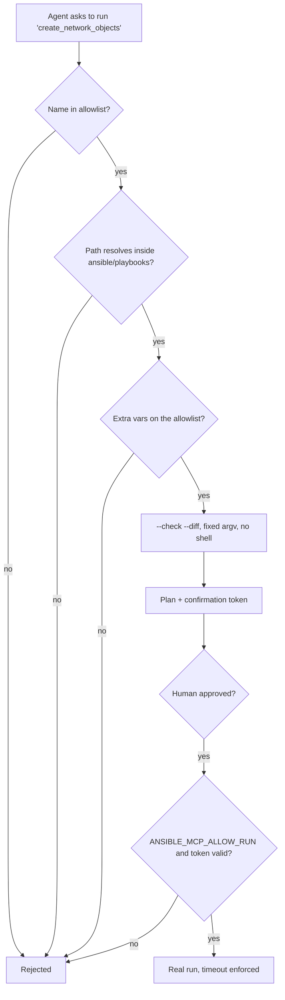

# Ansible MCP Server for Cisco Secure Firewall, lets an AI agent run reviewed cisco.fmcansible playbooks against FMC behind an allowlist and dry-run gate

[](../../LICENSE)
[](https://www.python.org/downloads/)
[](https://modelcontextprotocol.io)

Most teams that automate Cisco Secure Firewall already have a library of reviewed Ansible
playbooks and a change process built around them. Asking an AI agent to *generate* new
automation throws that away — it produces unreviewed code holding production credentials.
This Model Context Protocol server does the opposite: the agent selects from an
**allowlist** of playbooks a human already reviewed and merged, supplies validated
variables, and runs them. What executes is still the playbook in version control.

**Technology stack:** Python 3.12+, [FastMCP](https://github.com/jlowin/fastmcp),
`ansible-core`, and the `cisco.fmcansible` collection. Standalone server, speaks MCP over
stdio or HTTP. Docker image provided.

**Status:** 1.0.0. Read paths (list, describe, syntax check, dry run) are stable; treat
real execution as beta and validate against a lab first.

**Tools**

- `list_playbooks` — the playbooks this server is allowed to run, and which of them
  change configuration.
- `describe_playbook` — plays, task names, and declared variables, without running
  anything.
- `check_syntax` — `ansible-playbook --syntax-check`. Connects to nothing.
- `dry_run_playbook` — `--check --diff`. Reports what *would* change and returns a
  confirmation token.
- `run_playbook_for_real` — real execution. Requires `ANSIBLE_MCP_ALLOW_RUN=true` **and**
  a matching confirmation token from `dry_run_playbook`.

---

## Use Case

An MSP runs the same firewall procedures across 40 customer FMCs during weekly change
windows. The procedures are already codified as Ansible playbooks and reviewed by a
senior engineer. The bottleneck is the operator: they must pick the right playbook, get
the variables right, read a wall of `--check` output, and decide whether it is safe to
proceed — 40 times.

Letting an AI agent write playbooks would be faster and completely unacceptable: no
review, no git history, no answer to "what exactly ran last Tuesday?".

**The solution.** The agent becomes an operator, not an author. It can only choose from
the allowlist, can only set variables from a fixed permitted set, and must dry-run before
it can execute. It reads the `--check --diff` output and explains it in plain language,
which is exactly the part humans are worst at doing 40 times in a row.

**Outcomes and benefits**

| | Agent writes playbooks | This server |
| --- | --- | --- |
| What runs | Whatever the model generated | A playbook a human reviewed and merged |
| Change control | None | Normal git history and PR review |
| Blast radius | Unbounded | The allowlist |
| "What changed?" | Read the chat transcript | Read the playbook |
| Credential exposure | Model supplies connection vars | Credentials come only from the operator's environment |

**The challenge overcome.** Shelling out to `ansible-playbook` with model-supplied input
is a command-injection problem waiting to happen. The design avoids it entirely: fixed
argv with `shell=False`, playbook paths resolved and re-verified inside
`ansible/playbooks/`, and variables written to a temporary JSON file passed as `-e @file`
rather than interpolated onto a command line.

**Where it could go next.** Per-customer playbook allowlists, a job queue for concurrent
runs, and writing the dry-run diff back to a change ticket. See [../IDEAS.md](../IDEAS.md).

### Why this, instead of "let the agent write a playbook"

Because a generated playbook is unreviewed automation with production credentials
attached to it. This server inverts the relationship:

| | Agent writes playbooks | This server |
| --- | --- | --- |
| What runs | Whatever the model generated | A playbook a human reviewed and merged |
| Change control | None | Normal git history and PR review |
| Blast radius | Unbounded | The allowlist |
| Audit answer to "what changed?" | Read the transcript | Read the playbook |

The model still adds real value — choosing the right playbook, supplying the right
variables, explaining the diff, and summarising the recap — without becoming an
unreviewed author of production change.

## Security model



Specifically:

- **Fixed argv, `shell=False`.** Nothing from the model is concatenated into a command
  string.
- **Allowlisted playbooks.** Names are matched against a discovered set, then the
  resolved path is re-checked to live inside `ansible/playbooks/`. Traversal attempts
  such as `../../etc/passwd` never resolve.
- **Allowlisted variables.** Only a fixed set of `lower_snake_case` variables is
  accepted. Connection and credential variables (`ansible_httpapi_pass`, `ansible_user`,
  `fmc_password`, …) are **refused outright** — those come from the operator's
  environment, never from the caller.
- **Variables via file, not argv.** Accepted variables are written to a temporary JSON
  file and passed as `-e @file`, so no value can be read as a flag and no secret appears
  in the process table.
- **Filtered child environment.** Only an explicit passthrough list reaches the
  subprocess.
- **Hard timeout** (`ANSIBLE_MCP_TIMEOUT`, default 600s) with process kill.
- **Redacted, size-capped output.** Vault blobs, passwords, and tokens are stripped
  before anything reaches the model context.

---

## Installation

### Prerequisites

| Requirement | Version | Where to get it |
| --- | --- | --- |
| Python | 3.12 or later | <https://www.python.org/downloads/> |
| ansible-core | 2.21 or later | Installed by `requirements.txt` |
| Docker (optional) | any recent | <https://docs.docker.com/get-docker/> |
| An FMC | 7.0+ with REST API enabled | Your lab, or a [DevNet Sandbox](#related-sandbox) |
| An MCP-aware client | — | Claude Desktop, VS Code, Cursor, or any MCP agent |

### Clone and install

```bash
git clone https://github.com/ranilf2005/fw-automation.git
cd fw-automation/mcp_servers/ansible-mcp
```

**Linux / macOS**

```bash
python3 -m venv .venv
source .venv/bin/activate
pip install -r requirements.txt
ansible-galaxy collection install -r ansible-requirements.yml
```

**Windows PowerShell**

> Ansible does not run natively on Windows as a control node. Use
> [WSL2](https://learn.microsoft.com/windows/wsl/install) and follow the Linux steps
> inside it, or run the Docker image below.

### Verify the install

The unit tests need no Ansible control node, no FMC, and no credentials:

```bash
pip install -r ../../requirements-dev.txt
pytest tests
```

## Configuration

Copy `.env.example` to `.env`:

```bash
# Where the playbooks live. Defaults to this starter repo.
ANSIBLE_PROJECT_DIR=/absolute/path/to/fw-automation

# Optional: narrow the allowlist further.
ANSIBLE_PLAYBOOK_ALLOWLIST=get_domain,get_network_objects,get_security_zones

# FMC credentials, consumed by ansible/group_vars/all.yml. Callers cannot set these.
FMC_HOST=https://fmc.example.local
FMC_USERNAME=apiuser
FMC_PASSWORD=<export in your shell, or use ansible-vault>
VERIFY_SSL=true

# Real runs are off until you say otherwise.
ANSIBLE_MCP_ALLOW_RUN=false
ANSIBLE_MCP_TIMEOUT=600
```

Install the collection this repository's playbooks use:

```bash
ansible-galaxy collection install -r ansible-requirements.yml
```

> `cisco.fmcansible` is licensed **GPL-3.0-or-later** and maintained by Cisco. This
> project only invokes it through the standard `ansible-playbook` interface — it does not
> copy or link against its source. See [NOTICE](../../NOTICE).

### Using ansible-vault instead of environment variables

```bash
ansible-vault create /secure/path/vault.yml       # add: fmc_password: "..."
export ANSIBLE_VAULT_PASSWORD_FILE=/secure/path/vault-pass
```

---

## Usage

| `MCP_TRANSPORT` | Behaviour | Use for |
| --- | --- | --- |
| `stdio` (default) | MCP over stdin/stdout, no port | Desktop MCP clients |
| `http` | Serves `/mcp` on `MCP_HOST:MCP_PORT` | Shared deployments, Docker |

### Local Python (stdio)

```bash
python -m venv .venv
source .venv/bin/activate
pip install -r requirements.txt
MCP_TRANSPORT=stdio python -m sfw_mcp_ansible
```

Client configuration:

```json
{
  "mcpServers": {
    "cisco-fmc-ansible": {
      "command": ".venv/bin/python",
      "args": ["-m", "sfw_mcp_ansible"],
      "cwd": "/absolute/path/to/mcp_servers/ansible-mcp",
      "env": {
        "MCP_TRANSPORT": "stdio",
        "ANSIBLE_MCP_ALLOW_RUN": "false"
      }
    }
  }
}
```

### Local Python (HTTP)

```bash
MCP_TRANSPORT=http MCP_HOST=127.0.0.1 MCP_PORT=8001 python -m sfw_mcp_ansible
```

No built-in authentication — front it with a TLS-terminating authenticating proxy before
exposing it beyond localhost.

### Docker

```bash
docker compose up -d --build
```

The repository is mounted **read-only** at `/project`, so a compromised container cannot
rewrite the automation it is allowed to run. The container is non-root, read-only root
filesystem, all capabilities dropped.

---

### Manual testing

```bash
python client/test_client.py
```

Lists the allowlisted playbooks, then lets you describe, syntax-check, and dry-run them.

---

### Automated tests

Unit tests cover allowlist discovery, path-traversal rejection, variable validation
(including refusal of credential variables), PLAY RECAP parsing, changed-task extraction,
the run gate, confirmation-token binding, and vault/password redaction. No Ansible
control node or FMC is required.

```bash
pip install -r ../../requirements-dev.txt
pytest tests
```

---

### Integrating with LLM agents

1. Register the endpoint (stdio or HTTP).
2. Call `list_playbooks` — the agent learns what it may run and what mutates state.
3. Call `describe_playbook` to explain the intent to the user.
4. Call `check_syntax`, then `dry_run_playbook`.
5. **Show the dry-run result to a human.**
6. Call `run_playbook_for_real` with the plan and token unchanged.

A useful agent instruction:

> Always `dry_run_playbook` and show me the `would_change_tasks` list before running
> anything for real. If `mutates_configuration` is true, explicitly ask me to confirm.

### Worked example

> **User:** Add the new application subnet from the change ticket.

1. `list_playbooks` → `create_network_objects` (`mutates_configuration: true`).
2. `describe_playbook` → reads its payload from `ansible/vars/network_objects.yml`.
3. `dry_run_playbook` → `would_change_tasks: ["Create objects"]`, plus a token.
4. Agent shows the diff. Human approves.
5. `run_playbook_for_real(plan, token)` → recap `changed=1`, then *"verify in the GUI and
   deploy"*.

---

## Related Sandbox

You need an FMC to run the playbooks against. If you do not have a lab, Cisco DevNet
provides free sandboxes:

- [DevNet Sandbox catalogue](https://devnetsandbox.cisco.com/RM/Topology) — search for
  **Secure Firewall** or **Firepower**
- [Cisco Secure Firewall developer centre](https://developer.cisco.com/secure-firewall/)

Point `FMC_HOST`, `FMC_USERNAME`, and `FMC_PASSWORD` at the sandbox. Sandbox FMCs present
a self-signed certificate, so you will need `VERIFY_SSL=false` for a sandbox specifically.

`check_syntax` needs no FMC at all, so you can validate your setup before you have one.

## Known issues

- **`--check` fidelity depends on the modules involved.** Treat a dry run as a strong
  indication, not a guarantee, and validate against a lab first.
- **The server does not trigger FMC deployments.** Review and deploy from FMC.
- **One run at a time per server process.** There is no job queue; concurrent calls will
  contend.
- **Playbooks are classified as mutating by name prefix** (`create_`, `update_`,
  `delete_`, `deploy_`, `remove_`). Name new playbooks accordingly or they will be
  reported as read-only.
- **The variable allowlist is deliberately narrow.** Anything that could redirect the
  connection or inject a credential is refused. Extend `ALLOWED_EXTRA_VARS` in
  `sfw_mcp_ansible/runner.py` consciously.
- **Ansible does not run natively on a Windows control node.** Use WSL2 or Docker.
- **No built-in authentication on the HTTP transport.** Front it with a TLS-terminating
  authenticating reverse proxy.

Issues are tracked in
[GitHub Issues](https://github.com/ranilf2005/fw-automation/issues). Please use the
provided templates and include your FMC and `ansible-core` versions.

## Getting help

| I need... | Go to |
| --- | --- |
| Help with this server, a bug, or a feature idea | [GitHub Issues](https://github.com/ranilf2005/fw-automation/issues/new/choose) |
| To report a security vulnerability **in this repo** | [SECURITY.md](../../SECURITY.md) — do **not** open a public issue |
| Help with Cisco Secure Firewall itself | [Cisco TAC](https://www.cisco.com/c/en/us/support/index.html) |
| `cisco.fmcansible` collection issues | [CiscoDevNet/FMCAnsible](https://github.com/CiscoDevNet/FMCAnsible/issues) |
| MCP protocol questions | [modelcontextprotocol.io](https://modelcontextprotocol.io) |
| Community discussion | [Cisco Code Exchange Community](https://community.cisco.com/t5/code-exchange/bd-p/dev-code-exchange) |

Before opening an issue, run `check_syntax` and re-run with `LOG_LEVEL=DEBUG`. Full
guidance is in [SUPPORT.md](../../SUPPORT.md).

## Getting involved

Contributions are welcome. Current focus areas:

- Per-tenant playbook allowlists for MSP use
- A job queue so concurrent runs are safe
- Richer `--check` diff parsing, so the agent gets structure rather than raw text
- Writing the dry-run diff back to an ITSM change record

Development environment:

```bash
pip install -r requirements.txt
pip install -r ../../requirements-dev.txt
pre-commit install
pytest tests
```

Full instructions on *how* to contribute are in [CONTRIBUTING.md](../../CONTRIBUTING.md),
and all participation is governed by the [Code of Conduct](../../CODE_OF_CONDUCT.md).

## Credits and references

- [CiscoDevNet/FMCAnsible](https://github.com/CiscoDevNet/FMCAnsible) — the
  `cisco.fmcansible` collection this server invokes (GPL-3.0-or-later)
- [CiscoDevNet/CiscoFMC-MCP-server-community](https://github.com/CiscoDevNet/CiscoFMC-MCP-server-community) —
  the published FMC MCP server whose documentation structure this follows
- [FastMCP](https://github.com/jlowin/fastmcp) — the MCP server framework (Apache-2.0)
- [Model Context Protocol specification](https://modelcontextprotocol.io)
- [Ansible documentation](https://docs.ansible.com/)

## Security

See [SECURITY.md](../../SECURITY.md), and the Generative AI disclosure in
[NOTICE](../../NOTICE).

## Licensing info

This code is licensed under the MIT License. See [LICENSE](../../LICENSE) for details.

The `cisco.fmcansible` collection is **GPL-3.0-or-later**. It is installed from Ansible
Galaxy and invoked through the standard `ansible-playbook` interface — it is not copied,
vendored, or linked against, so no copyleft obligation attaches to this MIT-licensed
code. Full third-party attribution is in [NOTICE](../../NOTICE).

**Not a Cisco product.** Not developed, endorsed, or supported by Cisco Systems, Inc.,
and not covered by a Cisco support contract or Cisco TAC.
