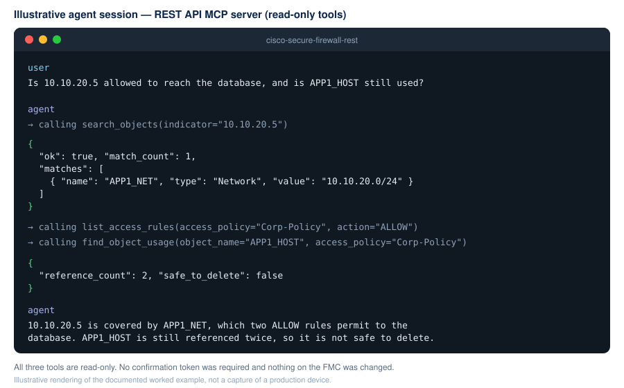
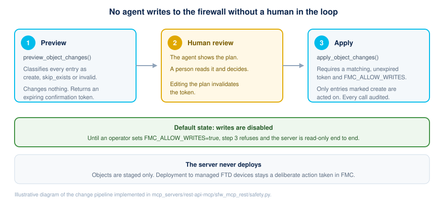
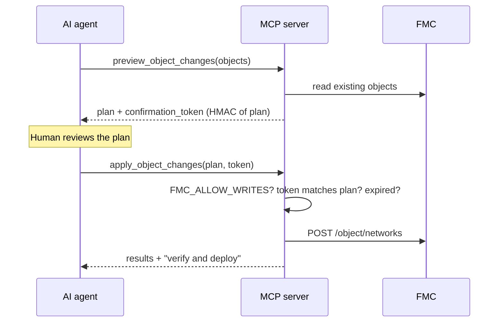

# Cisco Secure Firewall REST API MCP Server, lets an AI agent search FMC policy and propose object changes behind a preview-and-confirm gate

[](../../LICENSE)
[](https://www.python.org/downloads/)
[](https://modelcontextprotocol.io)

AI agents are good at firewall investigation work — correlating an IP to an object, an
object to the rules that reference it, and those rules to a recommendation — but giving a
language model a `create_object` tool means being one bad inference away from a policy
change. This Model Context Protocol server resolves that tension: it exposes the Cisco
Secure Firewall Management Center (FMC) REST API as seven read-only tools plus one write
tool that is **structurally incapable of running unreviewed**.

**Technology stack:** Python 3.11+, [FastMCP](https://github.com/jlowin/fastmcp), `httpx`.
Standalone server, speaks MCP over stdio or HTTP. Docker image provided.

**Status:** 1.0.0. Read paths are stable; treat the write path as beta until you have
confirmed the payloads against your own FMC version.



**Read-only tools**

- `list_fmc_profiles` — discover the configured FMC instances.
- `get_inventory` — domain, managed devices, access policies, and object counts.
- `search_objects` — find hosts, networks, and services by name, value, or IP
  containment. Searching `10.10.20.5` also returns the object holding `10.10.20.0/24`.
- `find_object_usage` — which access rules reference an object, and therefore whether it
  is safe to delete.
- `list_access_rules` — rule listing with action and enabled filters.
- `get_deployment_status` — devices with undeployed changes.
- `preview_object_changes` — diff proposed objects against FMC and return a plan plus a
  confirmation token. Changes nothing.

**Write tool (disabled by default)**

- `apply_object_changes` — execute a previously previewed plan. Requires
  `FMC_ALLOW_WRITES=true` **and** a matching, unexpired confirmation token.



---

## Use Case

A security operations engineer gets a question that sounds simple and is not:
*"Is 10.10.20.5 allowed to reach the database, and can we retire APP1_HOST?"*

Answering it by hand means opening FMC, searching objects, guessing which network object
contains that host, opening the access policy, and scrolling. Ten minutes per question,
and the "can we retire it?" half is usually answered with a shrug because nothing shows
object references.

**The solution.** Point an MCP-aware agent at this server and ask in plain language. The
agent calls `search_objects` (which understands IP containment, so `10.10.20.5` matches
`10.10.20.0/24`), then `list_access_rules`, then `find_object_usage` — which returns every
referencing rule and an explicit `safe_to_delete` flag.

**Outcomes and benefits**

| Before | After |
| --- | --- |
| ~10 minutes of GUI navigation per question | One conversational question, answered from structured JSON |
| "Which object covers this IP?" answered by eye | IP-containment matching does it exactly |
| Object cleanup avoided because references are unknown | `safe_to_delete` with the list of referencing rules |
| Change proposals typed straight into the GUI | `preview_object_changes` produces a reviewable plan first |

**The challenge overcome.** The hard part was not exposing the API — it was making it
safe to expose to a non-deterministic caller. The answer is the preview/confirm/apply
gate described below, which makes a single-call mutation impossible rather than merely
discouraged.

**Where it could go next.** Group, range, and FQDN object support; rule creation behind
the same gate; and an ITSM bridge so a change ticket produces the plan automatically. See
[../IDEAS.md](../IDEAS.md).

### Why the preview/apply split

Handing a language model a `create_object` tool means one bad inference away from a
policy change. This server makes that impossible by construction:



The token is an HMAC over the canonical JSON of the plan, signed with a key generated
fresh at process start. So:

- A plan the model edited after preview **fails**.
- A token from a different plan **fails**.
- A token more than 5 minutes old **fails** — FMC state may have moved on.
- A token from a previous run of the server **fails**.

---

## Installation

### Prerequisites

| Requirement | Version | Where to get it |
| --- | --- | --- |
| Python | 3.11 or later | <https://www.python.org/downloads/> |
| Docker (optional) | any recent | <https://docs.docker.com/get-docker/> |
| An FMC | 7.0+ with REST API enabled | Your lab, or a [DevNet Sandbox](#related-sandbox) |
| An MCP-aware client | — | Claude Desktop, VS Code, Cursor, or any MCP agent |

### Clone and install

```bash
git clone https://github.com/ranilf2005/fw-automation.git
cd fw-automation/mcp_servers/rest-api-mcp
```

**Linux / macOS**

```bash
python3 -m venv .venv
source .venv/bin/activate
pip install -r requirements.txt
```

**Windows PowerShell**

```powershell
python -m venv .venv
.venv\Scripts\Activate.ps1
pip install -r requirements.txt
```

### Verify the install

The unit tests need no FMC and no credentials:

```bash
pip install -r ../../requirements-dev.txt
pytest tests
```

## Configuration

### Single FMC (env mode)

Copy `.env.example` to `.env` and fill in at least:

```bash
FMC_BASE_URL=https://fmc.example.local
FMC_USERNAME=apiuser
FMC_PASSWORD=<set this in your shell, not in the file>
FMC_VERIFY_SSL=true
```

Use a **dedicated, least-privilege FMC API user** — not a shared administrator account.

### Multiple FMCs (profile mode)

Create one `*.env` file per FMC under `profiles/`. Copy `profiles/.env.example`:

```bash
FMC_PROFILE_ID=fmc-north-south
FMC_PROFILE_DISPLAY_NAME=FMC North-South
FMC_PROFILE_ALIASES=north,north-south,dc1
FMC_BASE_URL=https://north.example.local
FMC_USERNAME=apiuser
FMC_PASSWORD=
FMC_VERIFY_SSL=true
```

Then point the server at the directory:

```bash
FMC_PROFILES_DIR=profiles
FMC_PROFILE_DEFAULT=fmc-north-south
```

When `FMC_PROFILES_DIR` is set the server loads every `*.env` in that folder and exposes
them through `list_fmc_profiles`. When it is unset, the single-FMC variables are used.

### TLS

Certificate verification is **on by default**. To work with a private or self-signed CA,
trust the CA rather than disabling verification:

```bash
FMC_CA_BUNDLE=/absolute/path/to/fmc-ca.pem
```

`FMC_VERIFY_SSL=false` exists for labs only. It removes machine-in-the-middle protection
from your API credentials.

### Enabling writes

```bash
FMC_ALLOW_WRITES=false     # default
```

Leave it false unless you actively intend an agent to change configuration, and point it
at a lab FMC or a non-production access policy first.

### Logging

```bash
LOG_LEVEL=DEBUG
```

Logs go to **stderr**; stdout is reserved for MCP traffic in stdio mode. Credentials and
tokens are redacted before anything is written.

---

## Usage

### Transport selection

| `MCP_TRANSPORT` | Behaviour | Use for |
| --- | --- | --- |
| `stdio` (default) | Speaks MCP over stdin/stdout. No port opened. | Desktop MCP clients that spawn the server as a subprocess — Claude Desktop, VS Code, Cursor. |
| `http` | Listens on `MCP_HOST:MCP_PORT` and serves `/mcp`. | Shared or remote deployments, Docker, several concurrent agents. |

### Local Python (stdio)

```bash
python -m venv .venv
source .venv/bin/activate
pip install -r requirements.txt
MCP_TRANSPORT=stdio python -m sfw_mcp_rest
```

Running that by hand will look like it has hung. That is correct — it is waiting for an
MCP client on stdin/stdout. Normally your client starts it for you:

```json
{
  "mcpServers": {
    "cisco-fmc-rest": {
      "command": ".venv/bin/python",
      "args": ["-m", "sfw_mcp_rest"],
      "cwd": "/absolute/path/to/mcp_servers/rest-api-mcp",
      "env": {
        "MCP_TRANSPORT": "stdio",
        "FMC_PROFILES_DIR": "profiles",
        "FMC_PROFILE_DEFAULT": "fmc-north-south",
        "FMC_ALLOW_WRITES": "false"
      }
    }
  }
}
```

Notes for stdio mode:

- Point `command` at the interpreter inside your virtualenv so dependencies resolve.
- Set `cwd` to this folder so `FMC_PROFILES_DIR=profiles` resolves.
- For single-FMC mode, drop the profile variables and supply `FMC_BASE_URL` /
  `FMC_USERNAME` / `FMC_PASSWORD` instead.
- Nothing may be printed to stdout except MCP traffic. Keep custom logging on stderr.

### Local Python (HTTP)

```bash
MCP_TRANSPORT=http MCP_HOST=127.0.0.1 MCP_PORT=8000 python -m sfw_mcp_rest
```

Serves `http://127.0.0.1:8000/mcp`. The server has **no built-in authentication** — put a
TLS-terminating, authenticating reverse proxy in front of it before exposing it beyond
localhost.

### Docker

```bash
docker compose up -d --build
```

The compose file expects your `.env` in this folder and mounts `profiles/` read-only. The
container runs as a non-root user with a read-only root filesystem, all capabilities
dropped, and the port bound to loopback. Rebuild after changing `requirements.txt`.

---

### Manual testing

`client/test_client.py` runs the server in-process and drives its tools from a menu:

```bash
python client/test_client.py
```

It lists profiles, then lets you exercise inventory, object search, usage tracing, rule
listing, deployment status, and change preview against your own FMC.

---

### Automated tests

Unit tests cover profile parsing and resolution, the write gate, confirmation-token
issue/verify/expiry/tamper paths, redaction, object validation, and indicator matching.
None of them need a live FMC.

```bash
pip install -r ../../requirements-dev.txt
pytest tests
```

---

### Integrating with LLM agents

Any MCP-aware agent platform can consume this server:

1. Register the endpoint — stdio (spawn `python -m sfw_mcp_rest`) or HTTP
   (`https://<host>:8000/mcp` behind your proxy).
2. Call `list_fmc_profiles` to choose a target by `id` or alias.
3. Call the read tools with `fmc_profile` plus your indicator or filters.
4. For changes: call `preview_object_changes`, **render the plan to a human**, then call
   `apply_object_changes` with the plan and token unchanged.

A useful agent instruction:

> Before proposing any firewall change, call `find_object_usage` to check what a change
> would affect. Never call `apply_object_changes` without showing me the plan from
> `preview_object_changes` first.

### Worked example

> **User:** Is 10.10.20.5 allowed to reach the database, and is APP1_HOST still used?

1. `search_objects(indicator="10.10.20.5")` → finds `APP1_NET` (10.10.20.0/24).
2. `list_access_rules(access_policy="Corp-Policy", action="ALLOW")` → rules referencing
   `APP1_NET`.
3. `find_object_usage(object_name="APP1_HOST", access_policy="Corp-Policy")` →
   `safe_to_delete: false`, referenced by two rules.

All read-only, no confirmation needed, nothing changed.

---

## Related Sandbox

You need an FMC to run this against. If you do not have a lab, Cisco DevNet provides free
sandboxes:

- [DevNet Sandbox catalogue](https://devnetsandbox.cisco.com/RM/Topology) — search for
  **Secure Firewall** or **Firepower**
- [Cisco Secure Firewall developer centre](https://developer.cisco.com/secure-firewall/)

Point `FMC_BASE_URL`, `FMC_USERNAME`, and `FMC_PASSWORD` at the sandbox. Sandbox FMCs
present a self-signed certificate — download the CA and set `FMC_CA_BUNDLE` rather than
setting `FMC_VERIFY_SSL=false`. Then run `python client/test_client.py` and choose
`get_inventory`; if it returns device counts, you are connected.

## Known issues

- **FMC payload schemas vary by release.** Confirm endpoints and fields in **API
  Explorer** on your own FMC (`https://<fmc-host>/api/api-explorer`) before relying on
  write paths. This is the most common source of failures.
- **`apply_object_changes` handles Host and Network objects only.** Groups, ranges, FQDN
  objects, rules, and NAT are deliberately out of scope for the first release.
- **The server never triggers a deployment.** Review and deploy from FMC.
- **Listings are capped at 5000 objects per call** so responses stay bounded. Very large
  estates will be truncated; narrow your filters.
- **No built-in authentication on the HTTP transport.** Front it with a TLS-terminating
  authenticating reverse proxy before exposing it beyond localhost.
- **Confirmation tokens do not survive a restart.** The signing key is generated per
  process, on purpose — a plan is only valid against the FMC state it was computed from.

Issues are tracked in
[GitHub Issues](https://github.com/ranilf2005/fw-automation/issues). Please use the
provided templates and include your FMC version.

## Getting help

| I need... | Go to |
| --- | --- |
| Help with this server, a bug, or a feature idea | [GitHub Issues](https://github.com/ranilf2005/fw-automation/issues/new/choose) |
| To report a security vulnerability **in this repo** | [SECURITY.md](../../SECURITY.md) — do **not** open a public issue |
| Help with Cisco Secure Firewall itself | [Cisco TAC](https://www.cisco.com/c/en/us/support/index.html) |
| FMC REST API questions | [Cisco DevNet Secure Firewall](https://developer.cisco.com/secure-firewall/) |
| MCP protocol questions | [modelcontextprotocol.io](https://modelcontextprotocol.io) |
| Community discussion | [Cisco Code Exchange Community](https://community.cisco.com/t5/code-exchange/bd-p/dev-code-exchange) |

Before opening an issue, re-run with `LOG_LEVEL=DEBUG` and confirm the endpoint in API
Explorer. Full guidance is in [SUPPORT.md](../../SUPPORT.md).

## Getting involved

Contributions are welcome. Current focus areas:

- Object groups, ranges, and FQDN objects in `preview_object_changes`
- Rule creation behind the same preview/confirm gate
- Validating write payloads against more FMC versions
- Bearer-token or OAuth authentication for the HTTP transport

Development environment:

```bash
pip install -r requirements.txt
pip install -r ../../requirements-dev.txt
pre-commit install
pytest tests
```

Full instructions on *how* to contribute are in [CONTRIBUTING.md](../../CONTRIBUTING.md),
and all participation is governed by the
[Code of Conduct](../../CODE_OF_CONDUCT.md).

## Credits and references

- [CiscoDevNet/CiscoFMC-MCP-server-community](https://github.com/CiscoDevNet/CiscoFMC-MCP-server-community) —
  the published FMC MCP server whose profile model and documentation structure this
  server follows
- [FastMCP](https://github.com/jlowin/fastmcp) — the MCP server framework (Apache-2.0)
- [Model Context Protocol specification](https://modelcontextprotocol.io)
- [Cisco Secure Firewall Management Center REST API Quick Start Guide](https://www.cisco.com/c/en/us/td/docs/security/firepower/latest/api/REST/secure_firewall_management_center_rest_api_quick_start_guide.html)

## Security

Read [SECURITY.md](../../SECURITY.md) before pointing this at anything you care about.
Tool results contain your policy and addressing data, and when connected to a hosted
model that data is processed under the AI platform's terms — see the Generative AI
disclosure in [NOTICE](../../NOTICE).

## Licensing info

This code is licensed under the MIT License. See [LICENSE](../../LICENSE) for details.

Third-party attribution and Cisco trademark acknowledgement are in
[NOTICE](../../NOTICE).

**Not a Cisco product.** Not developed, endorsed, or supported by Cisco Systems, Inc.,
and not covered by a Cisco support contract or Cisco TAC.
