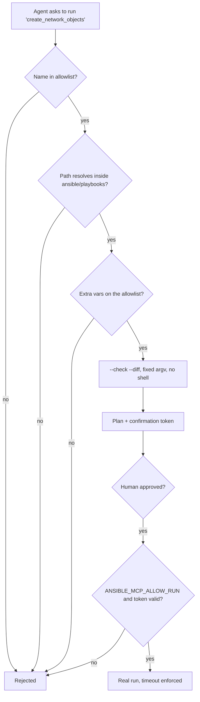

# Ansible MCP Server for Cisco Secure Firewall

MCP server that lets an AI agent run **reviewed** Ansible playbooks against Cisco Secure
Firewall Management Center (FMC).

The agent never writes automation. It selects from an allowlist of playbooks a human
already reviewed and merged, and supplies validated variables. The audit story stays
intact: what ran is still the playbook in version control.

**Tools**

- `list_playbooks` — the playbooks this server is allowed to run, and which of them
  change configuration.
- `describe_playbook` — plays, task names, and declared variables, without running
  anything.
- `check_syntax` — `ansible-playbook --syntax-check`. Connects to nothing.
- `dry_run_playbook` — `--check --diff`. Reports what *would* change and returns a
  confirmation token.
- `run_playbook_for_real` — real execution. Requires `ANSIBLE_MCP_ALLOW_RUN=true` **and**
  a matching confirmation token from `dry_run_playbook`.

---

## Why this instead of "let the agent write a playbook"

Because a generated playbook is unreviewed automation with production credentials
attached to it. This server inverts the relationship:

| | Agent writes playbooks | This server |
| --- | --- | --- |
| What runs | Whatever the model generated | A playbook a human reviewed and merged |
| Change control | None | Normal git history and PR review |
| Blast radius | Unbounded | The allowlist |
| Audit answer to "what changed?" | Read the transcript | Read the playbook |

The model still adds real value — choosing the right playbook, supplying the right
variables, explaining the diff, and summarising the recap — without becoming an
unreviewed author of production change.

## Security model



Specifically:

- **Fixed argv, `shell=False`.** Nothing from the model is concatenated into a command
  string.
- **Allowlisted playbooks.** Names are matched against a discovered set, then the
  resolved path is re-checked to live inside `ansible/playbooks/`. Traversal attempts
  such as `../../etc/passwd` never resolve.
- **Allowlisted variables.** Only a fixed set of `lower_snake_case` variables is
  accepted. Connection and credential variables (`ansible_httpapi_pass`, `ansible_user`,
  `fmc_password`, …) are **refused outright** — those come from the operator's
  environment, never from the caller.
- **Variables via file, not argv.** Accepted variables are written to a temporary JSON
  file and passed as `-e @file`, so no value can be read as a flag and no secret appears
  in the process table.
- **Filtered child environment.** Only an explicit passthrough list reaches the
  subprocess.
- **Hard timeout** (`ANSIBLE_MCP_TIMEOUT`, default 600s) with process kill.
- **Redacted, size-capped output.** Vault blobs, passwords, and tokens are stripped
  before anything reaches the model context.

---

## 1. Configure

Copy `.env.example` to `.env`:

```bash
# Where the playbooks live. Defaults to this starter repo.
ANSIBLE_PROJECT_DIR=/absolute/path/to/secure-firewall-automation-starter

# Optional: narrow the allowlist further.
ANSIBLE_PLAYBOOK_ALLOWLIST=get_domain,get_network_objects,get_security_zones

# FMC credentials, consumed by ansible/group_vars/all.yml. Callers cannot set these.
FMC_HOST=https://fmc.example.local
FMC_USERNAME=apiuser
FMC_PASSWORD=<export in your shell, or use ansible-vault>
VERIFY_SSL=true

# Real runs are off until you say otherwise.
ANSIBLE_MCP_ALLOW_RUN=false
ANSIBLE_MCP_TIMEOUT=600
```

Install the collection this repository's playbooks use:

```bash
ansible-galaxy collection install -r ansible-requirements.yml
```

> `cisco.fmcansible` is licensed **GPL-3.0-or-later** and maintained by Cisco. This
> project only invokes it through the standard `ansible-playbook` interface — it does not
> copy or link against its source. See [../../NOTICE](../../NOTICE).

### Using ansible-vault instead of environment variables

```bash
ansible-vault create /secure/path/vault.yml       # add: fmc_password: "..."
export ANSIBLE_VAULT_PASSWORD_FILE=/secure/path/vault-pass
```

---

## 2. Run the MCP server

| `MCP_TRANSPORT` | Behaviour | Use for |
| --- | --- | --- |
| `stdio` (default) | MCP over stdin/stdout, no port | Desktop MCP clients |
| `http` | Serves `/mcp` on `MCP_HOST:MCP_PORT` | Shared deployments, Docker |

### Local Python (stdio)

```bash
python -m venv .venv
source .venv/bin/activate
pip install -r requirements.txt
MCP_TRANSPORT=stdio python -m sfw_mcp_ansible
```

Client configuration:

```json
{
  "mcpServers": {
    "cisco-fmc-ansible": {
      "command": ".venv/bin/python",
      "args": ["-m", "sfw_mcp_ansible"],
      "cwd": "/absolute/path/to/mcp_servers/ansible-mcp",
      "env": {
        "MCP_TRANSPORT": "stdio",
        "ANSIBLE_MCP_ALLOW_RUN": "false"
      }
    }
  }
}
```

### Local Python (HTTP)

```bash
MCP_TRANSPORT=http MCP_HOST=127.0.0.1 MCP_PORT=8001 python -m sfw_mcp_ansible
```

No built-in authentication — front it with a TLS-terminating authenticating proxy before
exposing it beyond localhost.

### Docker

```bash
docker compose up -d --build
```

The repository is mounted **read-only** at `/project`, so a compromised container cannot
rewrite the automation it is allowed to run. The container is non-root, read-only root
filesystem, all capabilities dropped.

---

## 3. Manual testing

```bash
python client/test_client.py
```

Lists the allowlisted playbooks, then lets you describe, syntax-check, and dry-run them.

---

## 4. Automated tests

Unit tests cover allowlist discovery, path-traversal rejection, variable validation
(including refusal of credential variables), PLAY RECAP parsing, changed-task extraction,
the run gate, confirmation-token binding, and vault/password redaction. No Ansible
control node or FMC is required.

```bash
pip install -r ../../requirements-dev.txt
pytest tests
```

---

## 5. Integrating with LLM agents

1. Register the endpoint (stdio or HTTP).
2. Call `list_playbooks` — the agent learns what it may run and what mutates state.
3. Call `describe_playbook` to explain the intent to the user.
4. Call `check_syntax`, then `dry_run_playbook`.
5. **Show the dry-run result to a human.**
6. Call `run_playbook_for_real` with the plan and token unchanged.

A useful agent instruction:

> Always `dry_run_playbook` and show me the `would_change_tasks` list before running
> anything for real. If `mutates_configuration` is true, explicitly ask me to confirm.

### Worked example

> **User:** Add the new application subnet from the change ticket.

1. `list_playbooks` → `create_network_objects` (`mutates_configuration: true`).
2. `describe_playbook` → reads its payload from `ansible/vars/network_objects.yml`.
3. `dry_run_playbook` → `would_change_tasks: ["Create objects"]`, plus a token.
4. Agent shows the diff. Human approves.
5. `run_playbook_for_real(plan, token)` → recap `changed=1`, then *"verify in the GUI and
   deploy"*.

---

## Limits

- `--check` fidelity depends on the modules involved. Treat a dry run as a strong
  indication, not a guarantee, and validate against a lab first.
- The server does not trigger FMC deployments. Review and deploy from FMC.
- One run at a time per server process; there is no job queue.
- Playbooks are classified as mutating by name prefix (`create_`, `update_`, `delete_`,
  `deploy_`, `remove_`). Name new playbooks accordingly.

## Security

See [../../SECURITY.md](../../SECURITY.md), and the Generative AI disclosure in
[../../NOTICE](../../NOTICE).

## Licence

MIT — see [../../LICENSE](../../LICENSE). Not a Cisco product; not supported by Cisco TAC.
