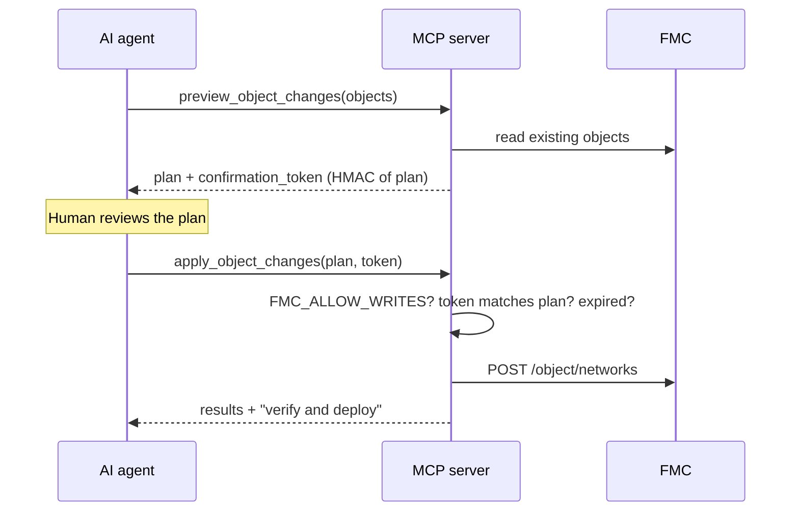

# Cisco Secure Firewall REST API MCP Server

MCP server that gives an AI agent the Cisco Secure Firewall Management Center (FMC)
REST API behind a safety harness. It answers investigation questions directly, and it
can propose configuration changes — but it is structurally incapable of changing a
firewall in a single tool call.

**Read-only tools**

- `list_fmc_profiles` — discover the configured FMC instances.
- `get_inventory` — domain, managed devices, access policies, and object counts.
- `search_objects` — find hosts, networks, and services by name, value, or IP
  containment. Searching `10.10.20.5` also returns the object holding `10.10.20.0/24`.
- `find_object_usage` — which access rules reference an object, and therefore whether it
  is safe to delete.
- `list_access_rules` — rule listing with action and enabled filters.
- `get_deployment_status` — devices with undeployed changes.
- `preview_object_changes` — diff proposed objects against FMC and return a plan plus a
  confirmation token. Changes nothing.

**Write tool (disabled by default)**

- `apply_object_changes` — execute a previously previewed plan. Requires
  `FMC_ALLOW_WRITES=true` **and** a matching, unexpired confirmation token.

---

## Why the preview/apply split

Handing a language model a `create_object` tool means one bad inference away from a
policy change. This server makes that impossible by construction:



The token is an HMAC over the canonical JSON of the plan, signed with a key generated
fresh at process start. So:

- A plan the model edited after preview **fails**.
- A token from a different plan **fails**.
- A token more than 5 minutes old **fails** — FMC state may have moved on.
- A token from a previous run of the server **fails**.

---

## 1. Configure FMC access

### Single FMC (env mode)

Copy `.env.example` to `.env` and fill in at least:

```bash
FMC_BASE_URL=https://fmc.example.local
FMC_USERNAME=apiuser
FMC_PASSWORD=<set this in your shell, not in the file>
FMC_VERIFY_SSL=true
```

Use a **dedicated, least-privilege FMC API user** — not a shared administrator account.

### Multiple FMCs (profile mode)

Create one `*.env` file per FMC under `profiles/`. Copy `profiles/.env.example`:

```bash
FMC_PROFILE_ID=fmc-north-south
FMC_PROFILE_DISPLAY_NAME=FMC North-South
FMC_PROFILE_ALIASES=north,north-south,dc1
FMC_BASE_URL=https://north.example.local
FMC_USERNAME=apiuser
FMC_PASSWORD=
FMC_VERIFY_SSL=true
```

Then point the server at the directory:

```bash
FMC_PROFILES_DIR=profiles
FMC_PROFILE_DEFAULT=fmc-north-south
```

When `FMC_PROFILES_DIR` is set the server loads every `*.env` in that folder and exposes
them through `list_fmc_profiles`. When it is unset, the single-FMC variables are used.

### TLS

Certificate verification is **on by default**. To work with a private or self-signed CA,
trust the CA rather than disabling verification:

```bash
FMC_CA_BUNDLE=/absolute/path/to/fmc-ca.pem
```

`FMC_VERIFY_SSL=false` exists for labs only. It removes machine-in-the-middle protection
from your API credentials.

### Enabling writes

```bash
FMC_ALLOW_WRITES=false     # default
```

Leave it false unless you actively intend an agent to change configuration, and point it
at a lab FMC or a non-production access policy first.

### Logging

```bash
LOG_LEVEL=DEBUG
```

Logs go to **stderr**; stdout is reserved for MCP traffic in stdio mode. Credentials and
tokens are redacted before anything is written.

---

## 2. Run the MCP server

### Transport selection

| `MCP_TRANSPORT` | Behaviour | Use for |
| --- | --- | --- |
| `stdio` (default) | Speaks MCP over stdin/stdout. No port opened. | Desktop MCP clients that spawn the server as a subprocess — Claude Desktop, VS Code, Cursor. |
| `http` | Listens on `MCP_HOST:MCP_PORT` and serves `/mcp`. | Shared or remote deployments, Docker, several concurrent agents. |

### Local Python (stdio)

```bash
python -m venv .venv
source .venv/bin/activate
pip install -r requirements.txt
MCP_TRANSPORT=stdio python -m sfw_mcp_rest
```

Running that by hand will look like it has hung. That is correct — it is waiting for an
MCP client on stdin/stdout. Normally your client starts it for you:

```json
{
  "mcpServers": {
    "cisco-fmc-rest": {
      "command": ".venv/bin/python",
      "args": ["-m", "sfw_mcp_rest"],
      "cwd": "/absolute/path/to/mcp_servers/rest-api-mcp",
      "env": {
        "MCP_TRANSPORT": "stdio",
        "FMC_PROFILES_DIR": "profiles",
        "FMC_PROFILE_DEFAULT": "fmc-north-south",
        "FMC_ALLOW_WRITES": "false"
      }
    }
  }
}
```

Notes for stdio mode:

- Point `command` at the interpreter inside your virtualenv so dependencies resolve.
- Set `cwd` to this folder so `FMC_PROFILES_DIR=profiles` resolves.
- For single-FMC mode, drop the profile variables and supply `FMC_BASE_URL` /
  `FMC_USERNAME` / `FMC_PASSWORD` instead.
- Nothing may be printed to stdout except MCP traffic. Keep custom logging on stderr.

### Local Python (HTTP)

```bash
MCP_TRANSPORT=http MCP_HOST=127.0.0.1 MCP_PORT=8000 python -m sfw_mcp_rest
```

Serves `http://127.0.0.1:8000/mcp`. The server has **no built-in authentication** — put a
TLS-terminating, authenticating reverse proxy in front of it before exposing it beyond
localhost.

### Docker

```bash
docker compose up -d --build
```

The compose file expects your `.env` in this folder and mounts `profiles/` read-only. The
container runs as a non-root user with a read-only root filesystem, all capabilities
dropped, and the port bound to loopback. Rebuild after changing `requirements.txt`.

---

## 3. Manual testing

`client/test_client.py` runs the server in-process and drives its tools from a menu:

```bash
python client/test_client.py
```

It lists profiles, then lets you exercise inventory, object search, usage tracing, rule
listing, deployment status, and change preview against your own FMC.

---

## 4. Automated tests

Unit tests cover profile parsing and resolution, the write gate, confirmation-token
issue/verify/expiry/tamper paths, redaction, object validation, and indicator matching.
None of them need a live FMC.

```bash
pip install -r ../../requirements-dev.txt
pytest tests
```

---

## 5. Integrating with LLM agents

Any MCP-aware agent platform can consume this server:

1. Register the endpoint — stdio (spawn `python -m sfw_mcp_rest`) or HTTP
   (`https://<host>:8000/mcp` behind your proxy).
2. Call `list_fmc_profiles` to choose a target by `id` or alias.
3. Call the read tools with `fmc_profile` plus your indicator or filters.
4. For changes: call `preview_object_changes`, **render the plan to a human**, then call
   `apply_object_changes` with the plan and token unchanged.

A useful agent instruction:

> Before proposing any firewall change, call `find_object_usage` to check what a change
> would affect. Never call `apply_object_changes` without showing me the plan from
> `preview_object_changes` first.

### Worked example

> **User:** Is 10.10.20.5 allowed to reach the database, and is APP1_HOST still used?

1. `search_objects(indicator="10.10.20.5")` → finds `APP1_NET` (10.10.20.0/24).
2. `list_access_rules(access_policy="Corp-Policy", action="ALLOW")` → rules referencing
   `APP1_NET`.
3. `find_object_usage(object_name="APP1_HOST", access_policy="Corp-Policy")` →
   `safe_to_delete: false`, referenced by two rules.

All read-only, no confirmation needed, nothing changed.

---

## Limits and things to confirm yourself

- FMC payload schemas vary by release. Confirm endpoints and fields in **API Explorer**
  on your own FMC (`https://<fmc-host>/api/api-explorer`) before relying on write paths.
- `apply_object_changes` handles Host and Network objects only. Groups, ranges, FQDN
  objects, rules, and NAT are deliberately out of scope for the first release.
- The server never triggers a deployment. Review and deploy from FMC.
- Listings are capped at 5000 objects per call to keep responses bounded.

## Security

Read [../../SECURITY.md](../../SECURITY.md) before pointing this at anything you care
about. Tool results contain your policy and addressing data, and when connected to a
hosted model that data is processed under the AI platform's terms — see the Generative AI
disclosure in [../../NOTICE](../../NOTICE).

## Licence

MIT — see [../../LICENSE](../../LICENSE). Not a Cisco product; not supported by Cisco TAC.
